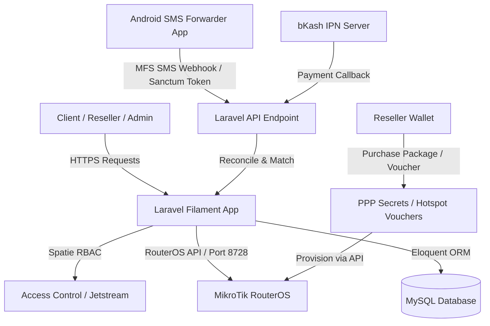
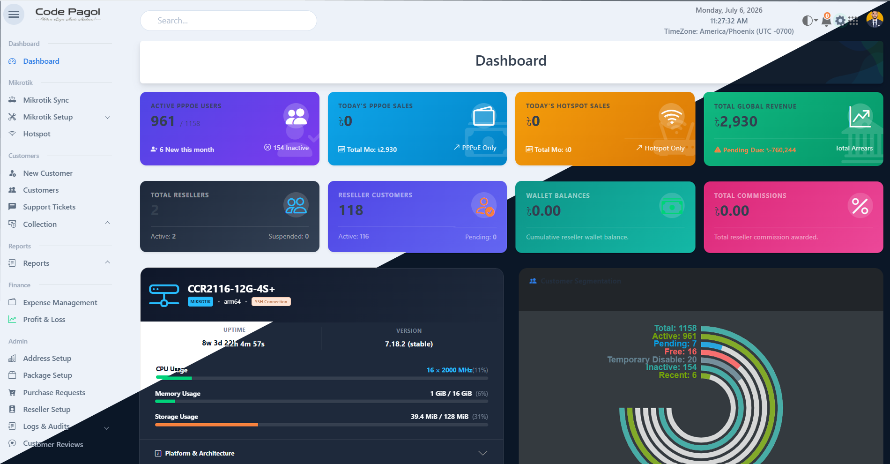
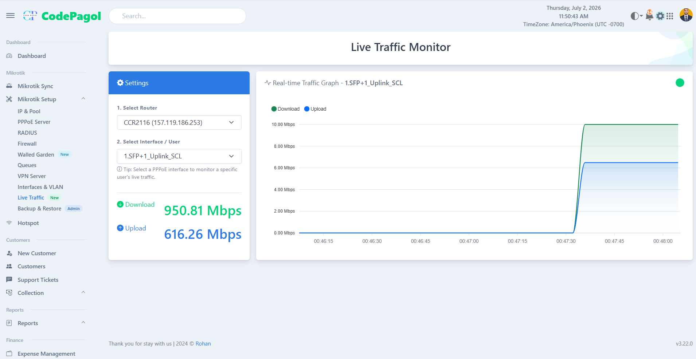
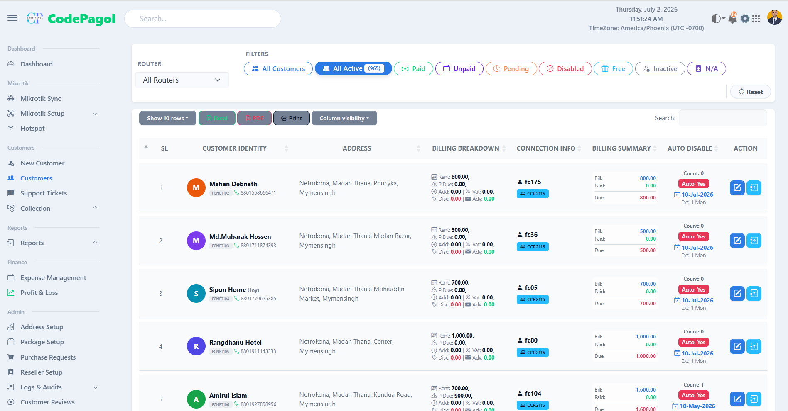
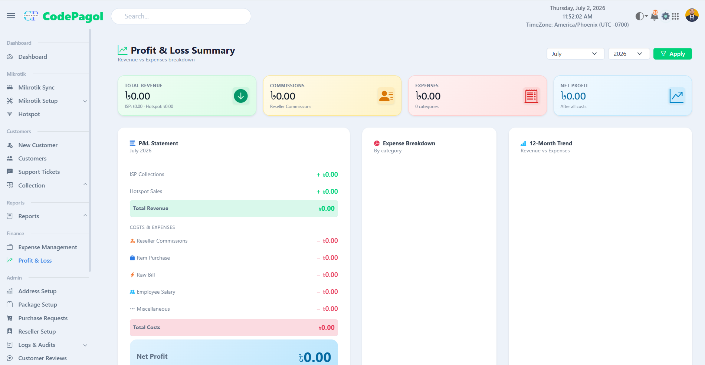

# MikroTik RouterOS API & ISP Billing Management System

<div align="center">


### Sponsored by [Friends Communications Limited](https://fcnetwork24.com)
### Demo: [isp.codepagol.com](https://isp.codepagol.com/)

A premium, modern Internet Service Provider (ISP) Billing & MikroTik RouterOS API management platform built on Laravel, Livewire, and Filament. It allows network administrators and resellers to seamlessly manage subscribers, PPPoE connections, hotspot vouchers, automated payment reconciliations, and commissions from a unified interface.

[Key Features](#key-features) • [Architecture](#system-architecture) • [Getting Started](#getting-started) • [Payment Webhooks](#webhook--mfs-auto-activation-setup) • [Screenshots](#screenshots-preview) • [Tech Stack](#tech-stack) • [License](#license)

</div>

---

## Key Features

🚀 **Comprehensive Billing & User Management**
- **PPPoE Secrets & Hotspot Billing:** Fully integrated CRUD operations directly communicating with MikroTik RouterOS.
- **Dynamic Address Pool Allocation:** Set and track IP pools for PPPoE and Hotspots.
- **Router Live Logging:** Collects real-time events and log outputs from connected MikroTik devices.

💼 **Reseller & Commission Ecosystem**
- **Wallet & Transactions:** Resellers can manage a credit-based wallet, buy packages or generate vouchers, and check their purchase history.
- **Upfront & Deferred Commissions:** Flexible configuration for commission structures paid upfront or during consumer activation.
- **Voucher Generator:** Bulk-generate internet access vouchers for Hotspot packages.

💳 **Automated Payment & Activation Webhooks**
- **bKash Merchant IPN:** Automated instant activation via bKash Merchant Webhook.
- **Android SMS Forwarder Integration:** Automated MFS SMS parsing (bKash, Nagad, Rocket) via specialized webhooks using secure API tokens.
- **Auto-Provisioning:** Instantly activates client lines on the MikroTik router upon successful payment matching.

🛡️ **Administration & Audits**
- **Filament Admin Panel:** Modern, responsive, and gorgeous dashboard for admins and resellers.
- **Spatie Activity Logs:** Thorough audit trails tracking every administrative action, payment edit, and router modification.
- **Role-Based Access Control:** Fine-grained authorization utilizing Spatie Laravel Permission.
- **Full-Text Search:** Scalable searches across customers and bills using Laravel Scout.

---

## System Architecture

The interaction flow between the client, administrative panel, MikroTik routers, and payment webhooks:



---

## Getting Started

### Prerequisites
- PHP >= 8.3
- Composer
- Node.js (with npm or yarn)
- MySQL / PostgreSQL
- MikroTik RouterOS with API Service enabled (default port `8728` or SSL `8729`)

### Installation Steps

1. **Clone the Repository**
   ```bash
   git clone https://github.com/CodePagol/ISP-Mikrotik-Billing.git
   cd ISP-Mikrotik-Billing
   ```

2. **Install Composer Dependencies**
   ```bash
   composer install
   ```

3. **Install Node Modules & Compile Assets**
   ```bash
   npm install
   npm run build
   ```

4. **Setup Environment Configuration**
   Copy the example environment file and generate the application key:
   ```bash
   cp .env.example .env
   php artisan key:generate
   ```

5. **Configure Database & Router in `.env`**
   Update your database credentials, mail settings, and security keys. Make sure to specify the local URL for IPNs:
   ```env
   DB_CONNECTION=mysql
   DB_HOST=127.0.0.1
   DB_PORT=3306
   DB_DATABASE=mikrotik_billing
   DB_USERNAME=root
   DB_PASSWORD=
   ```

6. **Run Migrations & Seed Dummy/Setup Data**
   ```bash
   php artisan migrate --seed
   ```
   *Note: This creates basic roles, permissions, administrative profiles, and placeholder system configurations.*

7. **Start Development Environment**
   You can run the full environment (web server, queue listener, and Vite assets compiler) using a single command:
   ```bash
   npm run dev
   ```

---

## Task Scheduling (Cron Job)

To automate monthly billing generation, daily SMS alerts, user disabling, MikroTik logging, and background synchronization, configure a single cron entry on your server:

```bash
* * * * * cd /path-to-your-project && php artisan schedule:run >> /dev/null 2>&1
```

### Scheduled Tasks:
- **Router Log Polling:** Runs every minute to pull log events from MikroTik.
- **Monthly Billing:** Automatically runs on the last day of the month at `23:45` (Asia/Dhaka timezone).
- **Billing SMS Notifications:** Sends out monthly bill SMS on the 1st of every month at `10:00`.
- **Alert Creation:** Generates daily connection & payment alerts at `08:00`.
- **User Disabling:** Automatically disables expired secrets/users daily at `08:30`.
- **MikroTik Sync:** Daily background synchronization of all secrets and hotspot accounts.
- **Log Pruning:** Cleans up router logs older than defined retention days daily at `04:00`.

---

## Webhook & MFS Auto-Activation Setup

The platform features automated activation through payment notifications.

### 1. bKash Merchant Webhook (IPN)
Configure your bKash Merchant account to forward payments to the following route:
- **Endpoint URL:** `https://your-domain.com/api/payment/bkash/ipn`
- **Method:** `POST`
- **CSRF Protection:** Automatically bypassed for this route.
- **Action:** Validates the transaction status, amounts, and maps the `payerReference` to the subscriber code to instantly renew and enable their MikroTik PPPoE / Hotspot connection.

### 2. MFS SMS Receiver Webhook (Android Forwarder)
For local manual payments where a merchant portal isn't available, you can use any Android SMS Forwarder app (e.g., **SMS to Webhook**, **MacroDroid**, or **Tasker**) to forward received transactional SMS.

- **Endpoint URL (Header Auth):** `https://your-domain.com/api/payment/mfs/sms-receiver`
  - **Headers Required:**
    - `Content-Type: application/json`
    - `Authorization: Bearer [YOUR_SANCTUM_API_TOKEN]`
- **Alternative URL (Query Parameter Auth):**
  - `https://your-domain.com/api/payment/mfs/sms-receiver?api_token=[YOUR_SANCTUM_API_TOKEN]`
  *(Generate your token from: Admin Dashboard -> Profile Settings -> API Tokens)*

- **Sample Request Payload:**
  ```json
  {
    "sender": "bKash",
    "message": "You have received BDT 500.00 from 01712345678. Ref CUSTOMER_1029. Fee 0.00. Balance 12000.00. TrxID A1B2C3D4E5"
  }
  ```

#### Recommended Forwarding Rules (Security Best Practices)
To prevent leakage of private OTPs or unauthorized code executions:
- **Sender Filter:** Set the app to only forward messages matching `bKash`, `NAGAD`, `Rocket`, `16216`, or `DBBL`.
- **Message Content Filter:**
  - *Must contain:* `Received BDT`, `received`, `Payment`, `TxnID`, `TrxID`, or `Tk`.
  - *Must NOT contain:* `OTP`, `verification code`, `security code`, `PIN`, or `password`.

---

## Screenshots Preview

| **Dashboard Analytics & System Health** | **Router & IP Management** |
|:---:|:---:|
|  <br> *Placeholder: Admin statistics, active routers, and revenue collection charts.* |  <br> *Placeholder: Connected MikroTik routers, status checker, and synchronization.* |
| **Subscriber Profiles & PPP Secrets** | **Reseller Commision Wallet & Vouchers** |
|  <br> *Placeholder: Managing user packages, passwords, profiles, and connection state.* |  <br> *Placeholder: Reseller credit dashboard, commission transaction log, and vouchers.* |

---

## Tech Stack

The core libraries and packages keeping the platform running smoothly:

### Backend Architecture
- **Framework:** Laravel 12.x
- **Admin Panel:** Filament PHP v3
- **Dynamic Frontend:** Livewire v4
- **Router Connection:** [Evilfreelancer RouterOS API PHP Wrapper](https://github.com/evilfreelancer/routeros-api-php)
- **Role Control:** [Spatie Laravel Permission](https://github.com/spatie/laravel-permission)
- **Audit Trails:** [Spatie Activity Log](https://github.com/spatie/laravel-activitylog)
- **PDF Invoices:** [carlos-meneses/laravel-mpdf](https://github.com/carlos-meneses/laravel-mpdf)
- **Spreadsheets:** [phpoffice/phpspreadsheet](https://github.com/PHPOffice/PhpSpreadsheet) & [spatie/simple-excel](https://github.com/spatie/simple-excel)

### Frontend & Assets
- **CSS Utility Engine:** Tailwind CSS, Bootstrap 5, Custom Sass
- **Chart Visualizations:** ApexCharts
- **Component Helpers:** Popper.js & Moment.js
- **UI Libraries:** jQuery & jQuery UI
- **Notifications:** SweetAlert2 & Toastr

---

## License

This project is open-source software licensed under the [AGPL-3.0 license](/LICENSE).

---

## Developed & Maintained by

**Md Jahangir Alam Rohan**
- **WhatsApp Support:** [+8801840451881](https://wa.me/8801840451881) (Fastest Response)
- **E-mail:** [rohan9222@gmail.com](mailto:rohan9222@gmail.com)
- **GitHub:** [@rohan9222](https://github.com/rohan9222)

## Support & Customization

For full setup support, custom ISP modules integration, payment gateway configuration, or technical queries:
- **WhatsApp:** [Chat on WhatsApp](https://wa.me/8801840451881)
- **E-mail:** [rohan9222@gmail.com](mailto:rohan9222@gmail.com)

*Feel free to submit a pull request or open an issue on the repository to contribute to the project.*
